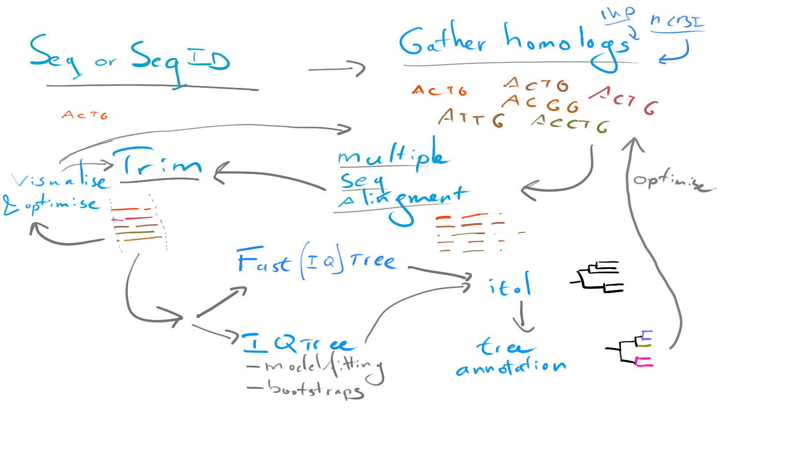

## Aim of this workflow
This repository contains a template workflow for state of the art molecular phylogeny inference using tools like `mafft`, `trimAl`, and `IQtree`. 
The workflow is a Jupyter notebook; a hands on workflow aimed at the practical steps needed from start to finish.
Instructions guide the user through the code necessary to run these tools and several checks and balances along the way from one starting sequence to a phylogenetic tree.
Secondly, the workflow encourages users to document their choices and output; making science a bit more transparent and reproducible.

This document does not aim to guide the user in interpreting phylogenies, or go into detail on the main considerations when designing your evolutionary inference.
However, luckily [this paper](https://doi.org/10.1002/bies.201900006) does a very good job in doing so and is written by true experts in the field.
Perhaps take a look at their [short video abstract](https://www.youtube.com/watch?v=VCt3l2pbdbQ) as well, explaining a use case.

## Overview
### requirements
To do this workflow, you need a linux environment like a linux computer, MacOS, or the 'windows sublayer for linux'. 
Second, you need the `conda` or `miniconda` framework for installing bioinformatics software. 
Install all required software as detailed in the conda environment included in this repository like so: `conda env create -f ./envs/conda-env-jalview.yaml`.
Third, you need one sequence or sequence ID you are interested in.

### steps
This workflow aims to guide you through the following steps
 1. acquire homologous sequences to your sequence via either ncbi blast, or the 1kP project (only for plant sequences)
 2. subset your input to contain all sequences of a limited number of species
 3. align sequences with `mafft`
 4. trim alignment with `trimAL`
    - Visualise alignment with Jalview
    - Evaluate and optimise
 5. infer a phylogenetic tree with fasttree
 6. infer a phylogenetic tree with IQtree
    - use modelfitting
    - choose a bootstrap method
 7. visualise the phylogenetic tree with iTol
    - annotate the phylogenetic tree in iTol

## Published Examples
Please find published examples here:
 - LAR phylogeny [GitHub](https://github.com/lauralwd/LAR_phylogeny_gungor-et-al-2020/tree/v1.00.00) [Zenodo](https://doi.org/10.5281/zenodo.3959057)
 - MIKC phylogeny [GitHub](https://github.com/lauralwd/MIKC_tree) [Zenodo](https://doi.org/10.5281/zenodo.4564374)
 - R2R3 MYB phylogeny [GitHub](https://github.com/lauralwd/azolla_MYBs) [Zenodo](https://doi.org/10.5281/zenodo.4564441)
 - ANS Phylogeny (comming soon) [GitHub](https://github.com/lauralwd/ANS_phylogeny)

This workflow is currently under construction, but nontheless citable via zenodo here: 
